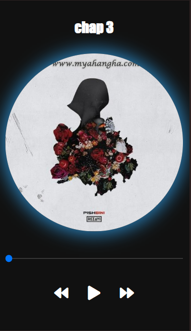

# MusicPlayer

  

## Overview

The **MusicPlayer** is a simple yet functional web-based music player that allows users to play, pause, and navigate between different songs. The player includes controls for playing, pausing, skipping to the next track, and going back to the previous one. Additionally, it provides a slider to control the current time of the track.

This project was developed as a portfolio sample to showcase basic JavaScript and DOM manipulation skills, as well as CSS animations.

## Prerequisites

To run this project locally, you need the following:

- A modern web browser (Google Chrome, Firefox, etc.)
- Basic knowledge of HTML, CSS, and JavaScript

## Installation

1. Clone this repository to your local machine:

   ```bash
   git clone https://github.com/sajjad-sisakhtpour/musicPlayer.git
   ```

2. Navigate to the project directory:

   ```bash
   cd musicPlayer
   ```

3. Open the `index.html` file in your browser to view the music player in action.

## Usage

1. Click on the play button to start playing the current song.
2. Use the next and previous buttons to switch between songs in the playlist.
3. Adjust the song's playback time using the slider at the bottom of the player.

## Examples

- Play music: Click the play button.
- Skip to next song: Click the "next" button.
- Go to previous song: Click the "previous" button.

## Documentation

- **HTML**: Contains the structure of the music player with elements for music title, cover image, and control buttons.
- **CSS**: Styles the player, including animations and layout.
- **JavaScript**: Handles the logic of music control, including play/pause functionality, song navigation, and updating the playback time.

## Contributing

1. Fork the repository.
2. Create a new branch (`git checkout -b feature-name`).
3. Make your changes and commit (`git commit -am 'Add new feature'`).
4. Push to your branch (`git push origin feature-name`).
5. Create a new Pull Request.

## License

This project is licensed under the MIT License - see the [LICENSE](LICENSE) file for details.

## Contact

- **Email**: sajjad.sisakhtpour@gmail.com
- **GitHub**: [sajjad-sisakhtpour](https://github.com/sajjad-sisakhtpour)
- **LinkedIn**: [sajad-sisakht-pour](https://ir.linkedin.com/in/sajad-sisakht-pour)

## Live Demo

You can try the live demo of this music player [here](https://your-live-demo-link.com).

## Screenshots

### Screenshot 1


### Screenshot 2


